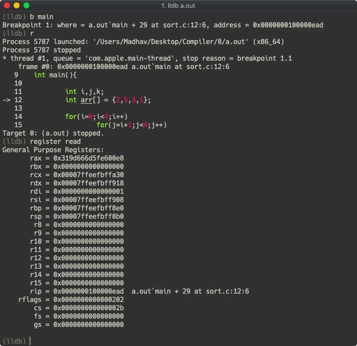

# Assignment 8
NAME : Tummala Madhav  
ROLL : 16CS01041

## Commands
For saving the temporary files

```
gcc -S file.c
```
For compiling with gdb support, to check line by line source to assembly translation
```
gcc -g -S file.c
```
Then use
```
gdb or lldb a.out
```

## Explanation
We have to first understand the some keywords in assembly language.
```
addl $42, %edi
```  
The `l` in `addl` means long.  
`$` in operands means an immediate value.  
The instruction adds `42` to `edi`.  
```
movq %rsp, %rbp
```
The `q` in `movq` means quad.  
`%` in operands means a register.  
The instruction moves content of `rsp` to `rbp`.  

If we run the code in gdb(or lldb) with a break point set, we can run `register read` to see the contents of register at any given point.  



## Registers
* rax, rbx, rcx and rdx are general purpose registers used to hold on to intermediate values loaded from memory or used during a calculation of some kind.  
* rsp is the stack pointer, which holds the memory location of the top of the stack.  
* rbp is the base pointer, which holds the memory location of the base of the current stack frame.  
* rip is the instruction pointer, which holds the memory location of the next instruction to execute.  
* and rflags holds a series of flags, used by comparison instructions for example.

## Code Explanation
`.cfi_* ` are assembler directives.  

### Simple Declaration

Code
```
int main(){
	int i = 10;
	return 0;
}
```
Assembly Code
```
	.section	__TEXT,__text,regular,pure_instructions
	.build_version macos, 10, 15	sdk_version 10, 15
	.globl	_main                   ## -- Begin function main
	.p2align	4, 0x90
_main:                                  ## @main
	.cfi_startproc
## %bb.0:
	pushq	%rbp
	.cfi_def_cfa_offset 16
	.cfi_offset %rbp, -16
	movq	%rsp, %rbp
	.cfi_def_cfa_register %rbp
	xorl	%eax, %eax
	movl	$0, -4(%rbp)
	movl	$10, -8(%rbp)
	popq	%rbp
	retq
	.cfi_endproc
                                        ## -- End function

.subsections_via_symbols
```
Explanation : Only one `main` section exists.  

| Line No | Instruction | Meaning |
| :---: | :---: | :---: |
| 5 | _main: | Start of the main function section |
| 8 | pushq %rbp | Setting up stack frame |
| 11 | movq	%rsp, %rbp | For local variables of function |
| 13 | xorl	%eax, %eax | To set %eax to zero |
| 14 | movl	$0, -4(%rbp) | Moving 0 to %rbp |
| 15 | movl	$10, -8(%rbp) | Moving 42 to %rbp |
| 16 | popq %rbp | Clean up the stack frame |
| 17 | retq | Clean up the stack frame |

### Addition Operation

Code
```
int main(){
	int i = 10;
  	i += 42;
	return 0;
}
```

Assembly
```
	.section	__TEXT,__text,regular,pure_instructions
	.build_version macos, 10, 15	sdk_version 10, 15
	.globl	_main                   ## -- Begin function main
	.p2align	4, 0x90
_main:                                  ## @main
	.cfi_startproc
## %bb.0:
	pushq	%rbp
	.cfi_def_cfa_offset 16
	.cfi_offset %rbp, -16
	movq	%rsp, %rbp
	.cfi_def_cfa_register %rbp
	xorl	%eax, %eax
	movl	$0, -4(%rbp)
	movl	$10, -8(%rbp)
	movl	-8(%rbp), %ecx
	addl	$42, %ecx
	movl	%ecx, -8(%rbp)
	popq	%rbp
	retq
	.cfi_endproc
                                        ## -- End function

.subsections_via_symbols
```
Explanation: A small change to add `42` to `i`

| Line No | Instruction | Meaning |
| :---: | :---: | :---: |
| 16 | movl	-8(%rbp), %ecx | Move the value of `i` into %ecx |
| 17 | addl	$42, %ecx | Add 42 to the value in %ecx |
| 18 | movl	%ecx, -8(%rbp) | Move the value in %ecx to %rbp |

### Conditional Statement

Code
```
int main(){
	int i = 10;
  	if(i==10) i += 42;
	return 0;
}
```
Assembly
```
	.section	__TEXT,__text,regular,pure_instructions
	.build_version macos, 10, 15	sdk_version 10, 15
	.globl	_main                   ## -- Begin function main
	.p2align	4, 0x90
_main:                                  ## @main
	.cfi_startproc
## %bb.0:
	pushq	%rbp
	.cfi_def_cfa_offset 16
	.cfi_offset %rbp, -16
	movq	%rsp, %rbp
	.cfi_def_cfa_register %rbp
	movl	$0, -4(%rbp)
	movl	$10, -8(%rbp)
	cmpl	$10, -8(%rbp)
	jne	LBB0_2
## %bb.1:
	movl	-8(%rbp), %eax
	addl	$42, %eax
	movl	%eax, -8(%rbp)
LBB0_2:
	xorl	%eax, %eax
	popq	%rbp
	retq
	.cfi_endproc
                                        ## -- End function

.subsections_via_symbols
```
Explanation: A new section `LBB0_2` is added to end the code. 

| Line No | Instruction | Meaning |
| :---: | :---: | :---: |
| 15 | cmpl $10, -8(%rbp) | Compare the value in %rbp with 10 |
| 16 | jne LBB0_2 | If not equal jump to that section |

It continues with the code for adding 42, which we have seen before. Else jumps to `LBB0_2` section: 

| Line No | Instruction | Meaning |
| :---: | :---: | :---: |
| 22 | xorl %eax, %eax | To set %eax to zero |
| 23 | popq %rbp | Clean up the stack frame |
| 24 | retq | Clean up the stack frame |

### Loops

Code
```
int main(){
	int i = 10;
  	while(i<20) i+=5;
	return 0;
}
```

Assembly
```
	.section	__TEXT,__text,regular,pure_instructions
	.build_version macos, 10, 15	sdk_version 10, 15
	.globl	_main                   ## -- Begin function main
	.p2align	4, 0x90
_main:                                  ## @main
	.cfi_startproc
## %bb.0:
	pushq	%rbp
	.cfi_def_cfa_offset 16
	.cfi_offset %rbp, -16
	movq	%rsp, %rbp
	.cfi_def_cfa_register %rbp
	movl	$0, -4(%rbp)
	movl	$10, -8(%rbp)
LBB0_1:                                 ## =>This Inner Loop Header: Depth=1
	cmpl	$20, -8(%rbp)
	jge	LBB0_3
## %bb.2:                               ##   in Loop: Header=BB0_1 Depth=1
	movl	-8(%rbp), %eax
	addl	$5, %eax
	movl	%eax, -8(%rbp)
	jmp	LBB0_1
LBB0_3:
	xorl	%eax, %eax
	popq	%rbp
	retq
	.cfi_endproc
                                        ## -- End function

.subsections_via_symbols
```
Explanation: Two sections have been added. `main` section corresponds to before loop. `LBB0_1` corresponds to loop section. `LBB0_3` corresponds to after loop section.  

| Line No | Instruction | Meaning |
| --- | --- | --- |
| 16 | cmpl	$20, -8(%rbp) | Compare the value in %rbp with 20 |
| 17 | jge	LBB0_3 | Jump if greater than or equal to LBB0_3 |
| 19 | movl	-8(%rbp), %eax | Move the value in %rbp to %eax |
| 20 | addl	$5, %eax | Add 5 to the value in %eax |
| 21 | movl	%eax, -8(%rbp) | Move the value of %eax to %rbp |
| 22 | jmp	LBB0_1 | Jump to LBB0_1 |

After loop section `LBB0_3` is just cleaning up like the `LBB0_2` section of the previous conditional statement case.  

### Sorting 
Code 
```
void swap(int *a, int *b){
	int t = *a;
	*a = *b;
	*b = t;
}

int main(){

	int i,j,k;
	int arr[] = {2,5,3,1};

	for(i=0;i<4;i++)
		for(j=i+1;j<4;j++)
			if(arr[i]>arr[j])
				swap(&arr[i],&arr[j]);

	return 0;

}
```
Assembly
```
	.section	__TEXT,__text,regular,pure_instructions
	.build_version macos, 10, 15	sdk_version 10, 15
	.globl	_swap                   ## -- Begin function swap
	.p2align	4, 0x90
_swap:                                  ## @swap
	.cfi_startproc
## %bb.0:
	pushq	%rbp
	.cfi_def_cfa_offset 16
	.cfi_offset %rbp, -16
	movq	%rsp, %rbp
	.cfi_def_cfa_register %rbp
	movq	%rdi, -8(%rbp)
	movq	%rsi, -16(%rbp)
	movq	-8(%rbp), %rsi
	movl	(%rsi), %eax
	movl	%eax, -20(%rbp)
	movq	-16(%rbp), %rsi
	movl	(%rsi), %eax
	movq	-8(%rbp), %rsi
	movl	%eax, (%rsi)
	movl	-20(%rbp), %eax
	movq	-16(%rbp), %rsi
	movl	%eax, (%rsi)
	popq	%rbp
	retq
	.cfi_endproc
                                        ## -- End function
	.globl	_main                   ## -- Begin function main
	.p2align	4, 0x90
_main:                                  ## @main
	.cfi_startproc
## %bb.0:
	pushq	%rbp
	.cfi_def_cfa_offset 16
	.cfi_offset %rbp, -16
	movq	%rsp, %rbp
	.cfi_def_cfa_register %rbp
	subq	$48, %rsp
	movq	___stack_chk_guard@GOTPCREL(%rip), %rax
	movq	(%rax), %rax
	movq	%rax, -8(%rbp)
	movl	$0, -36(%rbp)
	movq	L___const.main.arr(%rip), %rax
	movq	%rax, -32(%rbp)
	movq	L___const.main.arr+8(%rip), %rax
	movq	%rax, -24(%rbp)
	movl	$0, -40(%rbp)
LBB1_1:                                 ## =>This Loop Header: Depth=1
                                        ##     Child Loop BB1_3 Depth 2
	cmpl	$4, -40(%rbp)
	jge	LBB1_10
## %bb.2:                               ##   in Loop: Header=BB1_1 Depth=1
	movl	-40(%rbp), %eax
	addl	$1, %eax
	movl	%eax, -44(%rbp)
LBB1_3:                                 ##   Parent Loop BB1_1 Depth=1
                                        ## =>  This Inner Loop Header: Depth=2
	cmpl	$4, -44(%rbp)
	jge	LBB1_8
## %bb.4:                               ##   in Loop: Header=BB1_3 Depth=2
	movslq	-40(%rbp), %rax
	movl	-32(%rbp,%rax,4), %ecx
	movslq	-44(%rbp), %rax
	cmpl	-32(%rbp,%rax,4), %ecx
	jle	LBB1_6
## %bb.5:                               ##   in Loop: Header=BB1_3 Depth=2
	movslq	-40(%rbp), %rax
	shlq	$2, %rax
	leaq	-32(%rbp), %rcx
	movq	%rcx, %rdx
	addq	%rax, %rdx
	movslq	-44(%rbp), %rax
	shlq	$2, %rax
	addq	%rax, %rcx
	movq	%rdx, %rdi
	movq	%rcx, %rsi
	callq	_swap
LBB1_6:                                 ##   in Loop: Header=BB1_3 Depth=2
	jmp	LBB1_7
LBB1_7:                                 ##   in Loop: Header=BB1_3 Depth=2
	movl	-44(%rbp), %eax
	addl	$1, %eax
	movl	%eax, -44(%rbp)
	jmp	LBB1_3
LBB1_8:                                 ##   in Loop: Header=BB1_1 Depth=1
	jmp	LBB1_9
LBB1_9:                                 ##   in Loop: Header=BB1_1 Depth=1
	movl	-40(%rbp), %eax
	addl	$1, %eax
	movl	%eax, -40(%rbp)
	jmp	LBB1_1
LBB1_10:
	movq	___stack_chk_guard@GOTPCREL(%rip), %rax
	movq	(%rax), %rax
	movq	-8(%rbp), %rcx
	cmpq	%rcx, %rax
	jne	LBB1_12
## %bb.11:
	xorl	%eax, %eax
	addq	$48, %rsp
	popq	%rbp
	retq
LBB1_12:
	callq	___stack_chk_fail
	ud2
	.cfi_endproc
                                        ## -- End function
	.section	__TEXT,__literal16,16byte_literals
	.p2align	4               ## @__const.main.arr
L___const.main.arr:
	.long	2                       ## 0x2
	.long	5                       ## 0x5
	.long	3                       ## 0x3
	.long	1                       ## 0x1


.subsections_via_symbols
```

Assembly with gdb support
```
	.section	__TEXT,__text,regular,pure_instructions
	.build_version macos, 10, 15	sdk_version 10, 15
	.globl	_main                   ## -- Begin function main
	.p2align	4, 0x90
_main:                                  ## @main
Lfunc_begin0:
	.file	1 "/Users/Madhav/Desktop/Compiler/8" "sort.c"
	.loc	1 3 0                   ## sort.c:3:0
	.cfi_startproc
## %bb.0:
	pushq	%rbp
	.cfi_def_cfa_offset 16
	.cfi_offset %rbp, -16
	movq	%rsp, %rbp
	.cfi_def_cfa_register %rbp
	subq	$48, %rsp
	movq	___stack_chk_guard@GOTPCREL(%rip), %rax
	movq	(%rax), %rax
	movq	%rax, -8(%rbp)
	movl	$0, -36(%rbp)
Ltmp0:
	.loc	1 6 6 prologue_end      ## sort.c:6:6
	movq	L___const.main.arr(%rip), %rax
	movq	%rax, -32(%rbp)
	movq	L___const.main.arr+8(%rip), %rax
	movq	%rax, -24(%rbp)
Ltmp1:
	.loc	1 8 7                   ## sort.c:8:7
	movl	$0, -40(%rbp)
LBB0_1:                                 ## =>This Loop Header: Depth=1
                                        ##     Child Loop BB0_3 Depth 2
Ltmp2:
	.loc	1 8 11 is_stmt 0        ## sort.c:8:11
	cmpl	$4, -40(%rbp)
Ltmp3:
	.loc	1 8 2                   ## sort.c:8:2
	jge	LBB0_10
## %bb.2:                               ##   in Loop: Header=BB0_1 Depth=1
Ltmp4:
	.loc	1 9 9 is_stmt 1         ## sort.c:9:9
	movl	-40(%rbp), %eax
	.loc	1 9 10 is_stmt 0        ## sort.c:9:10
	addl	$1, %eax
	.loc	1 9 8                   ## sort.c:9:8
	movl	%eax, -44(%rbp)
LBB0_3:                                 ##   Parent Loop BB0_1 Depth=1
                                        ## =>  This Inner Loop Header: Depth=2
Ltmp5:
	.loc	1 9 14                  ## sort.c:9:14
	cmpl	$4, -44(%rbp)
Ltmp6:
	.loc	1 9 3                   ## sort.c:9:3
	jge	LBB0_8
## %bb.4:                               ##   in Loop: Header=BB0_3 Depth=2
Ltmp7:
	.loc	1 10 7 is_stmt 1        ## sort.c:10:7
	movslq	-40(%rbp), %rax
	movl	-32(%rbp,%rax,4), %ecx
	.loc	1 10 14 is_stmt 0       ## sort.c:10:14
	movslq	-44(%rbp), %rax
	.loc	1 10 13                 ## sort.c:10:13
	cmpl	-32(%rbp,%rax,4), %ecx
Ltmp8:
	.loc	1 10 7                  ## sort.c:10:7
	jle	LBB0_6
## %bb.5:                               ##   in Loop: Header=BB0_3 Depth=2
Ltmp9:
	.loc	1 11 7 is_stmt 1        ## sort.c:11:7
	movslq	-40(%rbp), %rax
	movl	-32(%rbp,%rax,4), %ecx
	.loc	1 11 6 is_stmt 0        ## sort.c:11:6
	movl	%ecx, -48(%rbp)
	.loc	1 12 12 is_stmt 1       ## sort.c:12:12
	movslq	-44(%rbp), %rax
	movl	-32(%rbp,%rax,4), %ecx
	.loc	1 12 5 is_stmt 0        ## sort.c:12:5
	movslq	-40(%rbp), %rax
	.loc	1 12 11                 ## sort.c:12:11
	movl	%ecx, -32(%rbp,%rax,4)
	.loc	1 13 12 is_stmt 1       ## sort.c:13:12
	movl	-48(%rbp), %ecx
	.loc	1 13 5 is_stmt 0        ## sort.c:13:5
	movslq	-44(%rbp), %rax
	.loc	1 13 11                 ## sort.c:13:11
	movl	%ecx, -32(%rbp,%rax,4)
Ltmp10:
LBB0_6:                                 ##   in Loop: Header=BB0_3 Depth=2
	.loc	1 15 3 is_stmt 1        ## sort.c:15:3
	jmp	LBB0_7
Ltmp11:
LBB0_7:                                 ##   in Loop: Header=BB0_3 Depth=2
	.loc	1 9 18                  ## sort.c:9:18
	movl	-44(%rbp), %eax
	addl	$1, %eax
	movl	%eax, -44(%rbp)
	.loc	1 9 3 is_stmt 0         ## sort.c:9:3
	jmp	LBB0_3
Ltmp12:
LBB0_8:                                 ##   in Loop: Header=BB0_1 Depth=1
	.loc	1 16 2 is_stmt 1        ## sort.c:16:2
	jmp	LBB0_9
Ltmp13:
LBB0_9:                                 ##   in Loop: Header=BB0_1 Depth=1
	.loc	1 8 15                  ## sort.c:8:15
	movl	-40(%rbp), %eax
	addl	$1, %eax
	movl	%eax, -40(%rbp)
	.loc	1 8 2 is_stmt 0         ## sort.c:8:2
	jmp	LBB0_1
Ltmp14:
LBB0_10:
	.loc	1 0 2                   ## sort.c:0:2
	movq	___stack_chk_guard@GOTPCREL(%rip), %rax
	movq	(%rax), %rax
	movq	-8(%rbp), %rcx
	cmpq	%rcx, %rax
	jne	LBB0_12
## %bb.11:
	xorl	%eax, %eax
	.loc	1 18 2 is_stmt 1        ## sort.c:18:2
	addq	$48, %rsp
	popq	%rbp
	retq
LBB0_12:
	.loc	1 0 0 is_stmt 0         ## sort.c:0:0
	callq	___stack_chk_fail
	ud2
Ltmp15:
Lfunc_end0:
	.cfi_endproc
                                        ## -- End function
	.section	__TEXT,__literal16,16byte_literals
	.p2align	4               ## @__const.main.arr
L___const.main.arr:
	.long	2                       ## 0x2
	.long	5                       ## 0x5
	.long	3                       ## 0x3
	.long	1                       ## 0x1

	.section	__DWARF,__debug_str,regular,debug
Linfo_string:
	.asciz	"Apple clang version 11.0.0 (clang-1100.0.32.5)" ## string offset=0
	.asciz	"sort.c"                ## string offset=47
	.asciz	"/Users/Madhav/Desktop/Compiler/8" ## string offset=54
	.asciz	"main"                  ## string offset=87
	.asciz	"int"                   ## string offset=92
	.asciz	"i"                     ## string offset=96
	.asciz	"j"                     ## string offset=98
	.asciz	"k"                     ## string offset=100
	.asciz	"arr"                   ## string offset=102
	.asciz	"__ARRAY_SIZE_TYPE__"   ## string offset=106
	.section	__DWARF,__debug_abbrev,regular,debug
Lsection_abbrev:
	.byte	1                       ## Abbreviation Code
	.byte	17                      ## DW_TAG_compile_unit
	.byte	1                       ## DW_CHILDREN_yes
	.byte	37                      ## DW_AT_producer
	.byte	14                      ## DW_FORM_strp
	.byte	19                      ## DW_AT_language
	.byte	5                       ## DW_FORM_data2
	.byte	3                       ## DW_AT_name
	.byte	14                      ## DW_FORM_strp
	.byte	16                      ## DW_AT_stmt_list
	.byte	23                      ## DW_FORM_sec_offset
	.byte	27                      ## DW_AT_comp_dir
	.byte	14                      ## DW_FORM_strp
	.ascii	"\264B"                 ## DW_AT_GNU_pubnames
	.byte	25                      ## DW_FORM_flag_present
	.byte	17                      ## DW_AT_low_pc
	.byte	1                       ## DW_FORM_addr
	.byte	18                      ## DW_AT_high_pc
	.byte	6                       ## DW_FORM_data4
	.byte	0                       ## EOM(1)
	.byte	0                       ## EOM(2)
	.byte	2                       ## Abbreviation Code
	.byte	46                      ## DW_TAG_subprogram
	.byte	1                       ## DW_CHILDREN_yes
	.byte	17                      ## DW_AT_low_pc
	.byte	1                       ## DW_FORM_addr
	.byte	18                      ## DW_AT_high_pc
	.byte	6                       ## DW_FORM_data4
	.byte	64                      ## DW_AT_frame_base
	.byte	24                      ## DW_FORM_exprloc
	.byte	3                       ## DW_AT_name
	.byte	14                      ## DW_FORM_strp
	.byte	58                      ## DW_AT_decl_file
	.byte	11                      ## DW_FORM_data1
	.byte	59                      ## DW_AT_decl_line
	.byte	11                      ## DW_FORM_data1
	.byte	73                      ## DW_AT_type
	.byte	19                      ## DW_FORM_ref4
	.byte	63                      ## DW_AT_external
	.byte	25                      ## DW_FORM_flag_present
	.byte	0                       ## EOM(1)
	.byte	0                       ## EOM(2)
	.byte	3                       ## Abbreviation Code
	.byte	52                      ## DW_TAG_variable
	.byte	0                       ## DW_CHILDREN_no
	.byte	2                       ## DW_AT_location
	.byte	24                      ## DW_FORM_exprloc
	.byte	3                       ## DW_AT_name
	.byte	14                      ## DW_FORM_strp
	.byte	58                      ## DW_AT_decl_file
	.byte	11                      ## DW_FORM_data1
	.byte	59                      ## DW_AT_decl_line
	.byte	11                      ## DW_FORM_data1
	.byte	73                      ## DW_AT_type
	.byte	19                      ## DW_FORM_ref4
	.byte	0                       ## EOM(1)
	.byte	0                       ## EOM(2)
	.byte	4                       ## Abbreviation Code
	.byte	36                      ## DW_TAG_base_type
	.byte	0                       ## DW_CHILDREN_no
	.byte	3                       ## DW_AT_name
	.byte	14                      ## DW_FORM_strp
	.byte	62                      ## DW_AT_encoding
	.byte	11                      ## DW_FORM_data1
	.byte	11                      ## DW_AT_byte_size
	.byte	11                      ## DW_FORM_data1
	.byte	0                       ## EOM(1)
	.byte	0                       ## EOM(2)
	.byte	5                       ## Abbreviation Code
	.byte	1                       ## DW_TAG_array_type
	.byte	1                       ## DW_CHILDREN_yes
	.byte	73                      ## DW_AT_type
	.byte	19                      ## DW_FORM_ref4
	.byte	0                       ## EOM(1)
	.byte	0                       ## EOM(2)
	.byte	6                       ## Abbreviation Code
	.byte	33                      ## DW_TAG_subrange_type
	.byte	0                       ## DW_CHILDREN_no
	.byte	73                      ## DW_AT_type
	.byte	19                      ## DW_FORM_ref4
	.byte	55                      ## DW_AT_count
	.byte	11                      ## DW_FORM_data1
	.byte	0                       ## EOM(1)
	.byte	0                       ## EOM(2)
	.byte	7                       ## Abbreviation Code
	.byte	36                      ## DW_TAG_base_type
	.byte	0                       ## DW_CHILDREN_no
	.byte	3                       ## DW_AT_name
	.byte	14                      ## DW_FORM_strp
	.byte	11                      ## DW_AT_byte_size
	.byte	11                      ## DW_FORM_data1
	.byte	62                      ## DW_AT_encoding
	.byte	11                      ## DW_FORM_data1
	.byte	0                       ## EOM(1)
	.byte	0                       ## EOM(2)
	.byte	0                       ## EOM(3)
	.section	__DWARF,__debug_info,regular,debug
Lsection_info:
Lcu_begin0:
.set Lset0, Ldebug_info_end0-Ldebug_info_start0 ## Length of Unit
	.long	Lset0
Ldebug_info_start0:
	.short	4                       ## DWARF version number
.set Lset1, Lsection_abbrev-Lsection_abbrev ## Offset Into Abbrev. Section
	.long	Lset1
	.byte	8                       ## Address Size (in bytes)
	.byte	1                       ## Abbrev [1] 0xb:0x8c DW_TAG_compile_unit
	.long	0                       ## DW_AT_producer
	.short	12                      ## DW_AT_language
	.long	47                      ## DW_AT_name
.set Lset2, Lline_table_start0-Lsection_line ## DW_AT_stmt_list
	.long	Lset2
	.long	54                      ## DW_AT_comp_dir
                                        ## DW_AT_GNU_pubnames
	.quad	Lfunc_begin0            ## DW_AT_low_pc
.set Lset3, Lfunc_end0-Lfunc_begin0     ## DW_AT_high_pc
	.long	Lset3
	.byte	2                       ## Abbrev [2] 0x2a:0x52 DW_TAG_subprogram
	.quad	Lfunc_begin0            ## DW_AT_low_pc
.set Lset4, Lfunc_end0-Lfunc_begin0     ## DW_AT_high_pc
	.long	Lset4
	.byte	1                       ## DW_AT_frame_base
	.byte	86
	.long	87                      ## DW_AT_name
	.byte	1                       ## DW_AT_decl_file
	.byte	3                       ## DW_AT_decl_line
	.long	124                     ## DW_AT_type
                                        ## DW_AT_external
	.byte	3                       ## Abbrev [3] 0x43:0xe DW_TAG_variable
	.byte	2                       ## DW_AT_location
	.byte	145
	.byte	88
	.long	96                      ## DW_AT_name
	.byte	1                       ## DW_AT_decl_file
	.byte	5                       ## DW_AT_decl_line
	.long	124                     ## DW_AT_type
	.byte	3                       ## Abbrev [3] 0x51:0xe DW_TAG_variable
	.byte	2                       ## DW_AT_location
	.byte	145
	.byte	84
	.long	98                      ## DW_AT_name
	.byte	1                       ## DW_AT_decl_file
	.byte	5                       ## DW_AT_decl_line
	.long	124                     ## DW_AT_type
	.byte	3                       ## Abbrev [3] 0x5f:0xe DW_TAG_variable
	.byte	2                       ## DW_AT_location
	.byte	145
	.byte	80
	.long	100                     ## DW_AT_name
	.byte	1                       ## DW_AT_decl_file
	.byte	5                       ## DW_AT_decl_line
	.long	124                     ## DW_AT_type
	.byte	3                       ## Abbrev [3] 0x6d:0xe DW_TAG_variable
	.byte	2                       ## DW_AT_location
	.byte	145
	.byte	96
	.long	102                     ## DW_AT_name
	.byte	1                       ## DW_AT_decl_file
	.byte	6                       ## DW_AT_decl_line
	.long	131                     ## DW_AT_type
	.byte	0                       ## End Of Children Mark
	.byte	4                       ## Abbrev [4] 0x7c:0x7 DW_TAG_base_type
	.long	92                      ## DW_AT_name
	.byte	5                       ## DW_AT_encoding
	.byte	4                       ## DW_AT_byte_size
	.byte	5                       ## Abbrev [5] 0x83:0xc DW_TAG_array_type
	.long	124                     ## DW_AT_type
	.byte	6                       ## Abbrev [6] 0x88:0x6 DW_TAG_subrange_type
	.long	143                     ## DW_AT_type
	.byte	4                       ## DW_AT_count
	.byte	0                       ## End Of Children Mark
	.byte	7                       ## Abbrev [7] 0x8f:0x7 DW_TAG_base_type
	.long	106                     ## DW_AT_name
	.byte	8                       ## DW_AT_byte_size
	.byte	7                       ## DW_AT_encoding
	.byte	0                       ## End Of Children Mark
Ldebug_info_end0:
	.section	__DWARF,__debug_macinfo,regular,debug
Ldebug_macinfo:
	.byte	0                       ## End Of Macro List Mark
	.section	__DWARF,__apple_names,regular,debug
Lnames_begin:
	.long	1212240712              ## Header Magic
	.short	1                       ## Header Version
	.short	0                       ## Header Hash Function
	.long	1                       ## Header Bucket Count
	.long	1                       ## Header Hash Count
	.long	12                      ## Header Data Length
	.long	0                       ## HeaderData Die Offset Base
	.long	1                       ## HeaderData Atom Count
	.short	1                       ## DW_ATOM_die_offset
	.short	6                       ## DW_FORM_data4
	.long	0                       ## Bucket 0
	.long	2090499946              ## Hash in Bucket 0
.set Lset5, LNames0-Lnames_begin        ## Offset in Bucket 0
	.long	Lset5
LNames0:
	.long	87                      ## main
	.long	1                       ## Num DIEs
	.long	42
	.long	0
	.section	__DWARF,__apple_objc,regular,debug
Lobjc_begin:
	.long	1212240712              ## Header Magic
	.short	1                       ## Header Version
	.short	0                       ## Header Hash Function
	.long	1                       ## Header Bucket Count
	.long	0                       ## Header Hash Count
	.long	12                      ## Header Data Length
	.long	0                       ## HeaderData Die Offset Base
	.long	1                       ## HeaderData Atom Count
	.short	1                       ## DW_ATOM_die_offset
	.short	6                       ## DW_FORM_data4
	.long	-1                      ## Bucket 0
	.section	__DWARF,__apple_namespac,regular,debug
Lnamespac_begin:
	.long	1212240712              ## Header Magic
	.short	1                       ## Header Version
	.short	0                       ## Header Hash Function
	.long	1                       ## Header Bucket Count
	.long	0                       ## Header Hash Count
	.long	12                      ## Header Data Length
	.long	0                       ## HeaderData Die Offset Base
	.long	1                       ## HeaderData Atom Count
	.short	1                       ## DW_ATOM_die_offset
	.short	6                       ## DW_FORM_data4
	.long	-1                      ## Bucket 0
	.section	__DWARF,__apple_types,regular,debug
Ltypes_begin:
	.long	1212240712              ## Header Magic
	.short	1                       ## Header Version
	.short	0                       ## Header Hash Function
	.long	2                       ## Header Bucket Count
	.long	2                       ## Header Hash Count
	.long	20                      ## Header Data Length
	.long	0                       ## HeaderData Die Offset Base
	.long	3                       ## HeaderData Atom Count
	.short	1                       ## DW_ATOM_die_offset
	.short	6                       ## DW_FORM_data4
	.short	3                       ## DW_ATOM_die_tag
	.short	5                       ## DW_FORM_data2
	.short	4                       ## DW_ATOM_type_flags
	.short	11                      ## DW_FORM_data1
	.long	0                       ## Bucket 0
	.long	1                       ## Bucket 1
	.long	193495088               ## Hash in Bucket 0
	.long	-594775205              ## Hash in Bucket 1
.set Lset6, Ltypes1-Ltypes_begin        ## Offset in Bucket 0
	.long	Lset6
.set Lset7, Ltypes0-Ltypes_begin        ## Offset in Bucket 1
	.long	Lset7
Ltypes1:
	.long	92                      ## int
	.long	1                       ## Num DIEs
	.long	124
	.short	36
	.byte	0
	.long	0
Ltypes0:
	.long	106                     ## __ARRAY_SIZE_TYPE__
	.long	1                       ## Num DIEs
	.long	143
	.short	36
	.byte	0
	.long	0
	.section	__DWARF,__debug_gnu_pubn,regular,debug
.set Lset8, LpubNames_end0-LpubNames_begin0 ## Length of Public Names Info
	.long	Lset8
LpubNames_begin0:
	.short	2                       ## DWARF Version
.set Lset9, Lcu_begin0-Lsection_info    ## Offset of Compilation Unit Info
	.long	Lset9
	.long	151                     ## Compilation Unit Length
	.long	42                      ## DIE offset
	.byte	48                      ## Attributes: FUNCTION, EXTERNAL
	.asciz	"main"                  ## External Name
	.long	0                       ## End Mark
LpubNames_end0:
	.section	__DWARF,__debug_gnu_pubt,regular,debug
.set Lset10, LpubTypes_end0-LpubTypes_begin0 ## Length of Public Types Info
	.long	Lset10
LpubTypes_begin0:
	.short	2                       ## DWARF Version
.set Lset11, Lcu_begin0-Lsection_info   ## Offset of Compilation Unit Info
	.long	Lset11
	.long	151                     ## Compilation Unit Length
	.long	124                     ## DIE offset
	.byte	144                     ## Attributes: TYPE, STATIC
	.asciz	"int"                   ## External Name
	.long	0                       ## End Mark
LpubTypes_end0:

.subsections_via_symbols
	.section	__DWARF,__debug_line,regular,debug
Lsection_line:
Lline_table_start0:
```

We can see that each instruction has additional information of `line-no`, `coloumn-no` and `file` in which it corresponds to. This helps in debugging.  
